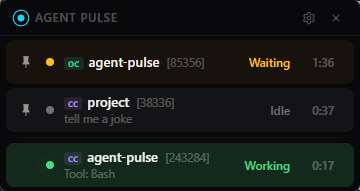
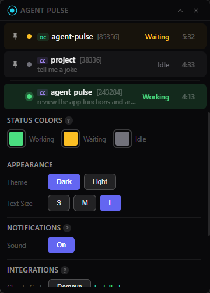

# Agent Pulse

A lightweight floating widget that monitors your AI coding agent sessions in real-time.


 

## What It Does

Agent Pulse is a small always-on-top capsule that floats at the top of your screen, showing what your AI coding agents are doing — across all your projects, all in one place. No more switching between terminals to check if an agent is still working, waiting for permission, or already done.

## Supported Agents

| Agent | Status |
|-------|--------|
| [Claude Code](https://docs.anthropic.com/en/docs/claude-code) | Supported |
| [OpenCode](https://opencode.ai) | Supported |

More agents can be added — contributions welcome!

## Features

- **Live session status** — see at a glance whether each agent is Working, Waiting for input, or Idle
- **Session details** — elapsed time, last prompt, last tool used, and project name
- **Pin & reorder** — drag sessions to keep important ones at the top
- **Sound alerts** — rising chime when a task completes, descending tone when permission is needed
- **Themes** — Dark, Light, and OLED themes with customizable accent colors
- **Text size** — Small, Medium, or Large to fit your preference
- **Auto cleanup** — stale sessions are automatically removed when the agent process exits

## Getting Started

### Install

Download the latest release for your platform from the [Releases](https://github.com/BingHanLin/agent-pulse/releases) page.

### Setup

1. Open the settings panel (gear icon)
2. Click **Configure** next to the agent you want to connect
3. That's it — start using your agents as usual and sessions will appear in the widget

### Usage

- The capsule floats at the top of your screen, showing all active agent sessions
- Each session displays its current state: **Working** (agent is running), **Waiting** (agent needs permission), or **Idle** (agent finished)
- Right-click the system tray icon to show/hide the widget, open settings, or quit
- Customize theme, colors, text size, and sound alerts in the settings panel

## Building from Source

### Prerequisites

- [Rust](https://rustup.rs/) (stable)
- [Node.js](https://nodejs.org/) (for Tauri CLI)
- Platform-specific dependencies: see [Tauri prerequisites](https://v2.tauri.app/start/prerequisites/)

```bash
npm install
npm run tauri dev    # Run in dev mode
npm run tauri build  # Production build
```

## Contributing

Want to add support for another AI agent? Check out the [contributor guide](CONTRIBUTING.md) or look at the existing providers in `src-tauri/src/providers/` for examples. Each agent integration is a single Rust file.

## License

MIT
